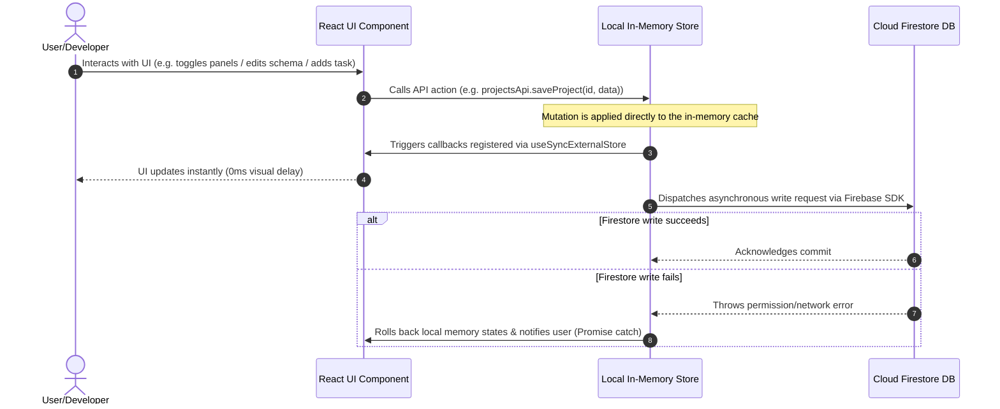

# Work OS 🎛️

Work OS is a professional, open-source, configuration-driven developer workspace dashboard. It is designed to consolidate SaaS project lifecycles, service credentials accounts, custom CLI script execution playbooks, bookmark resources, notes, and tasks in a unified workspace.

---

## 🚀 Key Features

*   **Integrated Project Workspace**: A consolidated project dashboard displaying stack metadata, Git repositories, deployment status, credentials links, environment variables, and associated scripts.
*   **In-App Schema Builder**: An administrative config panel (located in Settings) that allows developers to define custom metadata fields on-the-fly for Projects, Links, Tasks, and Commands. Supported field types include Text, Textarea, Select, Multi-select, URL, Tags, and Reference mapping (e.g. linking a project to verified service credentials).
*   **Modular Workspace Configurator**: Tailor the dashboard structure for each project. A drag-and-drop workspace manager allows users to toggle panel visibility and reorder layout columns (such as Tasks, Notes, Links, Calendar, Deployments, and Environment Variables).
*   **Sensitive Data Masking**: Tracks environment variables for Dev, Staging, and Production. Sensitive keys/values are masked in the UI with quick copy-to-clipboard functionality.
*   **Floating Quick Capture**: A keyboard-accessible capture drawer (`⌘⇧N` or floating button launcher) to capture bookmarks, ideas, command snippets, or tasks immediately into project backlogs.
*   **Terminal Command Playbooks**: Maintain an interactive playbook of project-specific commands (e.g., dev servers, deployment scripts, database migrations) with quick-copy actions.
*   **Multi-Provider Authentication**: Secure accounts managed via Firebase Authentication supporting Google SSO, GitHub SSO, and traditional Email/Password credentials.
*   **Companion Chrome Extension**: Includes a dedicated Quick Capture Chrome Extension to instantly bookmark active tabs and save them directly into your Work OS backend without context-switching.

---

## 🛠️ Technology Stack

*   **Framework**: Next.js 14 (configured as a single-page application router catch-all to prevent server-side hydration crashes)
*   **Frontend**: React 18, TypeScript, Tailwind CSS
*   **State Management**: Dependency-free reactive stores in `src/lib/` using React's native `useSyncExternalStore` API to ensure lightweight client-side state caches and fast renders
*   **Drag & Drop**: Native HTML5 Drag and Drop events hook (`useReorder`) built dependency-free to minimize bundle size
*   **UI Components**: Radix UI Primitives, Recharts, Lucide Icons, Tailwind CSS
*   **Database & Auth**: Firebase SDK v10 (Authentication & Cloud Firestore)

---

## 🏗️ System Design & Architecture

Work OS is a **configuration-driven developer portal**. Rather than compiling static fields for projects, layouts, and tasks, it fetches customizable schemas upon login and renders forms, panels, and layouts dynamically.

### 1. In-Depth Component & Reactivity Architecture

Work OS eliminates standard external state managers (e.g., Zustand or Redux) to avoid dependency overhead, opting for a lightweight state-listener subscription structure using React's native `useSyncExternalStore`. 

> [!NOTE]
> **Mermaid Diagrams Rendering:** If you see raw text block code like `graph TD` below, it is because your local text editor does not have a Mermaid preview extension active. Once pushed to **GitHub**, these blocks will automatically render into interactive visual system diagrams.

```mermaid
graph TD
    %% Styling
    classDef client fill:#1e1e2e,stroke:#313244,stroke-width:2px,color:#cdd6f4
    classDef store fill:#313244,stroke:#f5c2e7,stroke-width:2px,color:#cdd6f4
    classDef db fill:#181825,stroke:#a6e3a1,stroke-width:2px,color:#cdd6f4

    subgraph Client ["Client-Side React SPA (Next.js routing to Vite App)"]
        UI_KB["Quick Capture Keyboard Trigger<br/>(⌘⇧N Launcher / Palette)"]:::client
        
        subgraph UI_Views ["React Dashboard Layout Views"]
            UI["Main Workspace View"]:::client
            Configurator["Workspace Configurator<br/>(HTML5 Drag-and-Drop)"]:::client
            SchemaBuilder["Schema Builder Panel<br/>(Custom Field Blueprint Definitions)"]:::client
            ProjectsView["Projects Catalog list"]:::client
            ProjectDetail["Project Workspace Detail Panel"]:::client
        end
        
        subgraph Stores ["Custom Sync Store Layer"]
            S_Schema["schemaStore.ts<br/>(useSchema / schemaApi)"]:::store
            S_Projects["projectsStore.ts<br/>(useProject / projectsApi)"]:::store
            S_Config["workspaceConfigStore.ts<br/>(useWorkspaceConfig / configApi)"]:::store
            S_Captures["captureStore.ts<br/>(useCaptures / captureApi)"]:::store
            
            MemState["Memory Cache Arrays<br/>(In-Memory caches: projects, captures, schema)"]:::store
            Listeners["Listeners Map<br/>(Subscription callbacks set)"]:::store
        end
    end

    subgraph Backend ["Backend Cloud Infrastructure (Firebase)"]
        Auth["Firebase Authentication<br/>(Google, GitHub, & Email/Password)"]:::db
        Firestore["Cloud Firestore Database<br/>(Flat collections with wrk_ prefix)"]:::db
    end

    %% Interactions
    UI_KB -->|Launches QuickCapture| UI_Views
    UI --> Configurator
    UI --> SchemaBuilder
    UI --> ProjectsView
    ProjectsView --> ProjectDetail
    
    Configurator -->|Updates Layout| S_Config
    SchemaBuilder -->|Updates Blueprint Schema| S_Schema
    ProjectsView -->|Mutates Projects| S_Projects
    
    S_Schema --> MemState
    S_Projects --> MemState
    S_Config --> MemState
    S_Captures --> MemState
    
    MemState -->|Triggers callbacks| Listeners
    Listeners -->|Sync Re-render via useSyncExternalStore| UI_Views
    
    S_Schema -.->|Async Write (Background)| Firestore
    S_Projects -.->|Async Write (Background)| Firestore
    S_Config -.->|Async Write (Background)| Firestore
    S_Captures -.->|Async Write (Background)| Firestore
    
    UI_Views -.->|Auth Check| Auth
    Auth -->|Loads User Profile UID| Stores
    Firestore -.->|Fetch Collections on Auth State Change| Stores
```

### 2. Data Synchronization Lifecycle

The synchronization lifecycle guarantees that UI interactions complete in `<2ms` locally, decoupling network transit time from user feedback:



### 3. Database Schema & Firestore Collections

All queries scope strictly to the logged-in user's UID. The Firestore backend uses **flat root-level collections** prefixed with `wrk_` where documents contain a `userId` field (with the exception of config and schema documents, which use the user's `uid` as the document ID):

*   **`wrk_projects`**: Detail documents of all registered software projects.
    ```typescript
    interface Project {
      id: string;
      userId?: string;
      name: string;
      status: string; // Dynamic status mapped to schema definitions
      stack: string[];
      deployments: ProjectDeployment[]; // Provider, target and deploy urls
      services: ProjectService[]; // Associated external API services config
      accounts: string[]; // Linked credentials accounts IDs
      envVars: ProjectEnvVar[]; // Masked environment variables
      commands: ProjectCommand[]; // Inline terminal run playbooks
    }
    ```
*   **`wrk_captures`**: Floating quick-captured logs and ideas.
    ```typescript
    interface CaptureItem {
      id: string;
      userId?: string;
      title: string;
      type: "idea" | "command" | "link";
      createdAt: number;
    }
    ```
*   **`wrk_tasks`**: Tasks linked to specific projects or workspaces.
    ```typescript
    interface WorkOsTask {
      id: string;
      userId?: string;
      workspaceId: string;
      title: string;
      done: boolean;
      priority: "high" | "medium" | "low";
      createdAt: number;
    }
    ```
*   **`wrk_notes`**: Standalone documentation notes.
    ```typescript
    interface WorkOsNote {
      id: string;
      userId?: string;
      workspaceId?: string;
      title: string;
      body: string;
      updatedAt: string;
      tag: string;
    }
    ```
*   **`wrk_links`**: Bookmark resources.
    ```typescript
    interface WorkOsLink {
      id: string;
      userId?: string;
      workspaceId?: string;
      name: string;
      url: string;
      category: string;
    }
    ```
*   **`wrk_schema`**: Project field layouts and schema blueprints (document ID matches `user.uid`).
    ```typescript
    interface Schema {
      projects: {
        statuses: { id: string; name: string; color: string }[];
        fields: SchemaField[];
        accounts: SchemaAccount[];
      };
      links: { fields: SchemaField[] };
      tasks: { folders: boolean; tags: boolean; priority: boolean; fields: SchemaField[] };
      commands: { categories: string[]; fields: SchemaField[] };
    }
    ```
*   **`wrk_workspaceConfig`**: Modular panel orders and section visibility status (document ID matches `user.uid`).
    ```typescript
    interface WorkspaceConfig {
      columnOrder: string[]; // Reordered sections list
      enabledSections: string[]; // Active toggled visual panels
    }
    ```

---

## ⚙️ Setup & Local Installation

### Prerequisites
*   Node.js 18+ or Bun
*   A Firebase project with **Email/Password**, **Google Provider**, and **GitHub Provider** enabled in Authentication, and **Cloud Firestore** initialized.

### Getting Started

1.  **Clone the Repository & Install Dependencies**
    ```bash
    git clone https://github.com/your-username/work-os.git
    cd work-os
    npm install
    # or using Bun
    bun install
    ```

2.  **Configure Environment Variables**
    Create a `.env` file in the root directory:
    ```env
    NEXT_PUBLIC_FIREBASE_API_KEY=your_firebase_api_key
    NEXT_PUBLIC_FIREBASE_AUTH_DOMAIN=your_firebase_auth_domain
    NEXT_PUBLIC_FIREBASE_PROJECT_ID=your_firebase_project_id
    NEXT_PUBLIC_FIREBASE_STORAGE_BUCKET=your_firebase_storage_bucket
    NEXT_PUBLIC_FIREBASE_MESSAGING_SENDER_ID=your_firebase_messaging_sender_id
    NEXT_PUBLIC_FIREBASE_APP_ID=your_firebase_app_id
    ```

3.  **Run the Local Development Server**
    ```bash
    npm run dev
    ```
    Open [http://localhost:3000](http://localhost:3000) to access the application.

4.  **Production Compilation**
    ```bash
    npm run build
    npm run preview
    ```

---

## 🗺️ Project Structure

*   `src/` - Core application source
    *   `components/dashboard/` - Interface widgets (SchemaBuilder, WorkspaceConfig, OverviewCard, Sidebar, TasksWidget, ProjectDetailPanel, etc.)
    *   `components/workos/` - CommandPalette dialog, QuickCapture overlays, and WorkOS providers
    *   `components/ui/` - Atomic Radix UI primitives and utility inputs
    *   `contexts/` - Auth Context provider
    *   `lib/` - useSyncExternalStore stores (`projectsStore.ts`, `schemaStore.ts`, `workspaceConfigStore.ts`), and Firebase setup configuration (`firebase.ts` / `firestoreData.ts`)
    *   `views/` - Primary visual pages (Landing, SignIn, SignUp, Index, Projects, Accounts, Calendar, Links, Notes, Tasks, Settings)

## 🧩 Chrome Extension (Quick Capture)

Work OS includes a companion Manifest V3 Chrome Extension located in the [`extension/`](extension/) directory.

It allows you to securely authenticate with your workspace and instantly capture the active tab (Title & URL) into your `wrk_captures` Firestore collection. Because of the optimistic real-time stores, captured links appear instantly on your Work OS dashboard without reloading.

**To install the extension:**
1. Navigate to the `extension` folder and run `npm install` and `npm run build`.
2. Open Chrome and go to `chrome://extensions/`.
3. Enable **Developer mode**.
4. Click **Load unpacked** and select the `Work OS/extension/dist` directory.

---

## 🔒 Security & Firestore Rules

Work OS secures all data inherently via the authenticated User ID mapping. Ensure you deploy the customized Firestore security rules provided in `firestore.rules`.

```bash
# Deploy Firestore Rules
firebase deploy --only firestore:rules
```

---

## 🤝 Contributing

Read the [CONTRIBUTING.md](./CONTRIBUTING.md) for details on code standards, local routing strategies, and submitting Pull Requests.
*   **License**: This project is licensed under the MIT License. See the [LICENSE](LICENSE) file for details.
