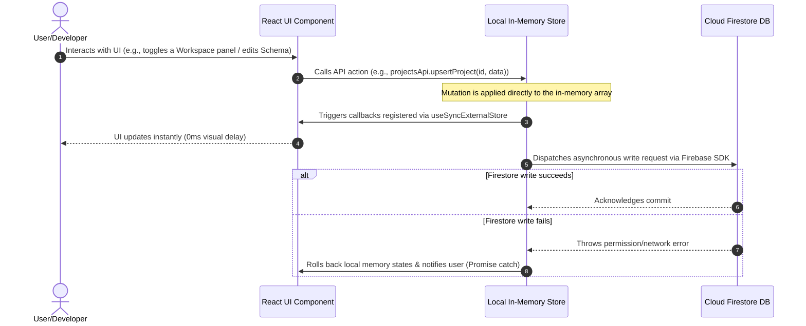

# Work OS 🎛️

Work OS is a professional, open-source, configuration-driven developer workspace dashboard. It is designed to consolidate active project lifecycles, service credentials, custom command snippets, environment variables, bookmark links, notes, and calendars in a unified dashboard.

---

## 🚀 Key Features

*   **Integrated Project Workspace**: A consolidated dashboard showing active projects grouped by status, technical stack metadata, git repository links, and deployment environments.
*   **Dynamic Schema Configurator**: An in-app schema builder (located in Settings) that allows developers to define custom metadata fields on-the-fly for Projects, Links, Tasks, and Commands. Supported field types include Text, Textarea, Select, Multi-select, URL, Tags, and Reference mapping (e.g., linking a project to verified service credentials).
*   **Workspace Layout Configurator**: Customize the dashboard view per project. A drag-and-drop configurator allows toggling visibility and reordering panels (such as Tasks, Notes, Links, Calendar, Deployments, and Environment Variables) using a lightweight, native HTML5 drag-and-drop implementation.
*   **Environment Variables Viewer**: Track environment variable keys and values for Dev/Staging/Prod. Sensitive credentials are visually masked in the user interface (displayed as dots) with copy-to-clipboard actions (no cryptographic database-side encryption).
*   **Floating Quick Capture**: A keyboard-accessible capture dialog (`⌘⇧N` or floating launcher) for logging quick ideas, commands, bookmarks, or tasks directly to active workspaces.
*   **Terminal Command Catalog**: Maintain an interactive directory of project-specific command snippets (e.g., development, deployment, database migrations, tests) with quick-copy capabilities.
*   **Google SSO Authentication**: Secure, credentials-free sign-in powered by Firebase Authentication and Google Identity Services (exclusively Google/Gmail accounts, email-password flows are disabled).

---

## 🛠️ Technology Stack

*   **Framework**: Next.js 14 (configured as a single-page application router catch-all)
*   **Frontend**: React 18.3, TypeScript, Vite
*   **State Management**: Custom local state reactivity engine powered by React's native `useSyncExternalStore` for immediate client-side rendering with Firestore sync
*   **Drag & Drop**: Custom, dependency-free drag-and-drop hook (`useReorder`) built directly on HTML5 Drag and Drop events
*   **UI Components**: Radix UI Primitives, Recharts, Lucide Icons
*   **Database & Auth**: Firebase Authentication & Google Cloud Firestore

---

## 🏗️ System Design & Architecture

Work OS is a **configuration-driven developer portal**. Rather than compiling static fields for projects, accounts, and tasks, it fetches customizable schemas upon login and renders forms, panels, and layouts dynamically.

```
┌────────────────────────────────────────────────────────┐
│                      CLIENT SIDE                       │
│                                                        │
│  ┌──────────────────┐                                  │
│  │   React View     │ <─────────────────────────────┐  │
│  └────────┬─────────┘                               │  │
│           │ Triggers Updates                        │  │
│           ▼                                         │  │
│  ┌──────────────────┐      Subscription Trigger     │  │
│  │   projectsApi    │ ──────────────────────────┐   │  │
│  │   schemaApi      │                           │   │  │
│  └────────┬─────────┘                           ▼   │  │
│           │                        ┌────────────┴┐  │  │
│           │ Updates Memory Array   │ Listeners   │  │  │
│           ▼                        │ (Set of cbs)│  │  │
│  ┌──────────────────┐              └────────────┬┘  │  │
│  │ Memory state     │                           │   │  │
│  │ (e.g. items = [])│ <─────────────────────────┘   │  │
│  └────────┬─────────┘                               │  │
│           │                                         │  │
│           │ Asynchronous Writes                     │  │
│           ▼                                         │  │
│  ┌──────────────────┐                               │  │
│  │  Firestore SDK   │ ──────────────────────────────┘  │
│  └────────┬─────────┘                                  │
└───────────┼────────────────────────────────────────────┘
            │
            │ Async Network Transports
            ▼
┌────────────────────────────────────────────────────────┐
│                     FIRESTORE DB                       │
│                                                        │
│  - users/{uid}/schema/main                             │
│  - users/{uid}/projects/{projectId}                    │
│  - users/{uid}/workspaceConfig/main                    │
└────────────────────────────────────────────────────────┘
```

### 1. High-Level Component & Reactivity Architecture

Work OS eliminates standard external state managers (e.g., Zustand or Redux) to avoid dependency overhead, opting for a lightweight state-listener subscription structure using React's native `useSyncExternalStore`. For renderers supporting Mermaid diagrams, the component flow is visualized below:

```mermaid
graph TD
    %% Styling
    classDef client fill:#1e1e2e,stroke:#313244,stroke-width:2px,color:#cdd6f4
    classDef store fill:#313244,stroke:#f5c2e7,stroke-width:2px,color:#cdd6f4
    classDef db fill:#181825,stroke:#a6e3a1,stroke-width:2px,color:#cdd6f4

    subgraph Client ["Client-Side React SPA (Vite/Next.js Catch-All Router)"]
        UI["React Component View<br/>(ProjectWorkspace, SchemaBuilder, Projects)"]:::client
        
        subgraph Stores ["Custom Sync Store Layer"]
            S_Schema["schemaStore.ts<br/>(useSchema / schemaApi)"]:::store
            S_Projects["projectsStore.ts<br/>(useProject / projectsApi)"]:::store
            S_Config["workspaceConfigStore.ts<br/>(useWorkspaceConfig)"]:::store
            
            MemState["Memory Cache Arrays<br/>(items = [])"]:::store
            Listeners["Listeners Map<br/>(Set of callbacks)"]:::store
        end
    end

    subgraph Backend ["Backend Cloud Infrastructure (Firebase)"]
        Auth["Firebase Authentication<br/>(Google Identity Provider Only)"]:::db
        Firestore["Cloud Firestore Database"]:::db
    end

    %% Interactions
    UI -->|1. Triggers Action| S_Projects
    UI -->|1. Triggers Action| S_Schema
    
    S_Projects -->|2. Mutates Memory| MemState
    S_Schema -->|2. Mutates Memory| MemState
    
    MemState -->|3. Triggers Notifications| Listeners
    Listeners -->|4. Sync Re-render via useSyncExternalStore| UI
    
    S_Projects -.->|5. Async Write (Background)| Firestore
    S_Schema -.->|5. Async Write (Background)| Firestore
    UI -.->|Initialize Sessions| Auth
    Auth -->|Loads User Profile UID| Stores
    Firestore -.->|6. Fetch on Auth State Change| Stores
```

### 2. Data Synchronization Lifecycle

The synchronization lifecycle guarantees that UI interactions complete in `<2ms` locally, decoupling network transit time from user feedback:



### 3. Database Schema & Collections Layout

Firestore collections are isolated under user-scoped document roots to enforce strict multi-tenant separation:

*   `/users/{uid}` - User profile configuration document.
    *   `/users/{uid}/schema/main` - Stores custom metadata blueprints for dynamic inputs:
        ```typescript
        interface Schema {
          projects: {
            statuses: { id: string; name: string; color: string }[];
            fields: SchemaField[];
            accounts: SchemaAccount[];
          };
          links: { fields: SchemaField[] };
          tasks: { folders: boolean; tags: boolean; priority: boolean; fields: SchemaField[] };
          commands: { categories: string[]; fields: SchemaField[] };
        }
        ```
    *   `/users/{uid}/projects/{projectId}` - Contains details of each registered software asset:
        ```typescript
        interface Project {
          id: string;
          name: string;
          status: string; // Dynamic status mapped to status schema
          stack: string[];
          deployments: ProjectDeployment[]; // URL, target, provider keys
          services: ProjectService[]; // Service references, host configurations
          accounts: string[]; // Foreign key references to verified SchemaAccounts
          envVars: ProjectEnvVar[]; // Masked environment configurations (e.g., DEV_DB_PASS)
          commands: ProjectCommand[]; // Quick CLI shell snippets
        }
        ```
    *   `/users/{uid}/workspaceConfig/main` - Layout customisation options for each dashboard instance:
        ```typescript
        interface WorkspaceConfig {
          columnOrder: string[]; // Custom drag-and-drop column positioning
          enabledSections: string[]; // Toggled widgets (Tasks, Notes, Links, Calendar)
        }
        ```

---

## ⚙️ Setup & Local Installation

### Prerequisites
*   Node.js 18+ or Bun
*   A Firebase project with **Google Provider** enabled in Authentication, and **Cloud Firestore** initialized.

### Getting Started

1.  **Clone the Repository & Install Dependencies**
    ```bash
    git clone https://github.com/your-username/work-os.git
    cd work-os
    npm install
    # or using Bun
    bun install
    ```

2.  **Configure Environment Variables**
    Create a `.env` file in the root directory:
    ```env
    NEXT_PUBLIC_FIREBASE_API_KEY=your_firebase_api_key
    NEXT_PUBLIC_FIREBASE_AUTH_DOMAIN=your_firebase_auth_domain
    NEXT_PUBLIC_FIREBASE_PROJECT_ID=your_firebase_project_id
    NEXT_PUBLIC_FIREBASE_STORAGE_BUCKET=your_firebase_storage_bucket
    NEXT_PUBLIC_FIREBASE_MESSAGING_SENDER_ID=your_firebase_messaging_sender_id
    NEXT_PUBLIC_FIREBASE_APP_ID=your_firebase_app_id
    ```

3.  **Run the Local Development Server**
    ```bash
    npm run dev
    ```
    Open [http://localhost:3000](http://localhost:3000) to access the application.

4.  **Production Compilation**
    ```bash
    npm run build
    npm run preview
    ```

---

## 🗺️ Project Structure

*   `src/` - Application source code
    *   `components/dashboard/` - Interactive widgets (SchemaBuilder, WorkspaceConfig, OverviewCard, Sidebar, CustomWidgets)
    *   `components/workos/` - Provider wrappers, quick-capture panel, and command palette
    *   `components/ui/` - Reusable Radix UI design primitives
    *   `views/` - Primary views (Projects list, ProjectWorkspace workspace detail drawer, Accounts, Calendar, Links, Notes, Tasks)
    *   `lib/` - useSyncExternalStore state modules, Firestore integration layer (`firestoreData.ts`)
*   `public/` - Static assets and application icons

---

## 📄 License & Contributing

*   **Contributing**: We welcome open-source contributions! Please review our [Contributing Guidelines](CONTRIBUTING.md) to learn how to propose changes.
*   **License**: This project is licensed under the MIT License. See the [LICENSE](LICENSE) file for details.
